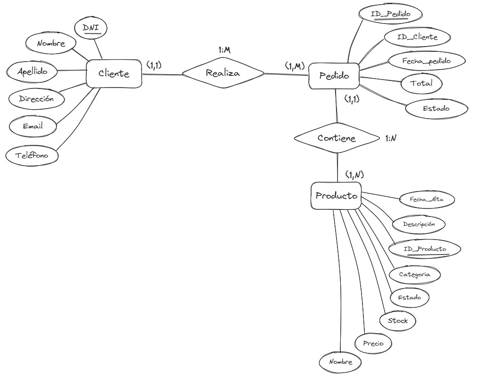

# 📚 TRABAJO PRACTICO ADMINISTRACIÓN DE BASES DE DATOS

## 👨‍🏫 PROFESOR: **Emanuel Alejandro Odstrcil**

### 🧑 Nombre del equipo: **Alfa buena maravilla onda dinamita escuadrón LOBO**

### 🚀 Integrantes del equipo

| Nombre                                                        | Apellido                                                            | DNI      |
| ------------------------------------------------------------- | ------------------------------------------------------------------- | -------- |
| [Lola](https://www.linkedin.com/in/lolarod/ "Linkedin")       | Rodriguez Farias | 47345708 |
| [Diego](https://www.linkedin.com/in/floresdiegoa/ "Linkedin") | Flores Nube | 95034804 |
| [Andres](https://www.linkedin.com/in/andywclav/ "Linkedin")   | Clavijo Rojas | 19110862 |


# PROYECTO 

**_`Sistema de venta de ropa de segunda mano.`_**

<!-- TODO: REVER ESTO  -->

> El objetivo de este sistema es el de ayudar al cliente a poder organizar su ropa de segunda mano o con fallas de fabrica, de forma fácil y rápida para la venta de las mismas.

## **_CREACION DE LA BASE DE DATOS_**

```sql
CREATE DATABASE IF NOT EXISTS IFTS_N18_ADB_TP_ALFA_LOBO;
USE IFTS_N18_ADB_TP_ALFA_LOBO;
```

## **_CREACION DE LAS TABLAS_**

`Tabla Clientes`

```sql
CREATE TABLE IF NOT EXISTS Clientes(
 ID INT NOT NULL PRIMARY KEY AUTO_INCREMENT,
 DNI INT(9) NOT NULL UNIQUE,
 Nombre VARCHAR(30) NOT NULL,
 Apellido VARCHAR(50) NOT NULL,
 Direccion VARCHAR(75) NOT NULL,
 Email NVARCHAR(255) NOT NULL, #NVARCHAR? OR VARCHAR?
 Telefono VARCHAR(15) NOT NULL,
 Sexo ENUM('M','F','X'),
 Fecha_Nacimiento DATE
);
```

### **_Condiciones que deben cumplirse para una aceptacion de usuario_**

- Tener una edad igual o mayor a 16 años
- Contar con un correo electrónico válido (Se necesita confirmación de correo electrónico)
- Contar con una contraseña válida (Minimo de 8 caracteres)

`Tabla Productos`

```sql
CREATE TABLE IF NOT EXISTS Productos(
 ID INT NOT NULL PRIMARY KEY AUTO_INCREMENT,
 Nombre VARCHAR(30),
 Descripción TEXT,
 Precio_Unitario DECIMAL(10, 2),
 Categoría ENUM('remera', 'buzo', 'pantalon', 'zapatillas', 'accesorio'),
 Stock INT(1),
 Estado ENUM('falla de fabrica', 'usado'),
 Fecha_Alta DATE
);
```

`Tabla Metodo_Pago`

```sql
CREATE TABLE IF NOT EXISTS Metodo_Pago(
 ID INT NOT NULL PRIMARY KEY AUTO_INCREMENT,
 Tipo_Pago ENUM('Efectivo', 'Tarjeta', 'Criptomonedas'),
 Estado_Pago ENUM('pendiente', 'completado')
);
```

`Tabla Pedido` <!-- Tal vez detalle_pedido? -->

```sql
CREATE TABLE IF NOT EXISTS Pedido(
 ID INT NOT NULL PRIMARY KEY AUTO_INCREMENT,
 ID_Cliente INT NOT NULL,
 ID_Pago INT NOT NULL,
 Cantidad_Productos INT(2),
 Fecha_Pedido DATETIME,
 Valor_Total DECIMAL(10, 2),
 Estado ENUM('pendiente', 'enviado', 'entregado'),
 FOREIGN KEY (ID_Cliente) REFERENCES lobos.Clientes(ID),
 FOREIGN KEY (ID_Pago) REFERENCES lobos.Metodo_pago(ID)
);
```

## INGRESAMOS DATOS A LA BASE DE DATOS

`Tabla Clientes`

```sql
INSERT INTO Clientes (DNI, Nombre, Apellido, Direccion, Email, Telefono, Sexo, Fecha_Nacimiento
VALUES 
(94034804, 'Diego Alexandro', 'Flores Nube', 'Quito 4340', 'Floresnubediego@gmail.com', '11 5142-7181', 'M', '1990-05-15'),
(12345678, 'María', 'García Pérez', 'Calle Mayor 123', 'maria@example.com', '12 3456-7890', 'F', '1985-10-20'),
(98765432, 'Juan', 'López Martínez', 'Avenida Libertad 45', 'juan@example.com', '11 2345-6789', 'M', '1978-03-12'),
(54321678, 'Ana', 'Martínez Ruiz', 'Plaza España 7', 'ana@example.com', '11 8765-4321', 'F', '1992-07-28'),
(87654322, 'Pedro', 'Rodríguez Sánchez', 'Calle Alameda 32', 'pedro@example.com', '11 9876-5432', 'M', '1980-01-08'),
(34567812, 'Laura', 'Gómez Fernández', 'Paseo del Prado 67', 'laura@example.com', '12 3456-7890', 'F', '1989-12-03'),
(23145687, 'Carlos', 'Sánchez Pérez', 'Calle Mayor 89', 'carlos@example.com', '11 6543-2109', 'M', '1987-09-17'),
(98765431, 'Marta', 'Fernández Martínez', 'Avenida de la Constitución 54', 'marta@example.com', '11 7890-1234', 'F', '1983-06-25'),
(65432178, 'David', 'Pérez Rodríguez', 'Plaza del Sol 21', 'david@example.com', '11 4321-0987', 'M', '1975-11-30'),
(87654321, 'Elena', 'Ruiz Gómez', 'Calle Gran Vía 78', 'elena@example.com', '12 3456-7890', 'F', '1995-04-18'),
(47345708, 'Lola', 'Commenge', 'Matienzo 1643', 'lolarod@example.com', '11 6032-8221', 'X', '2006-06-14'),
(19110862, 'Andres', 'Rodriguez', 'Calle Falsa 123', 'meencanta@example.com', '11 2756-6586', 'F', '1900-06-30');
```

`Tabla Productos`

```sql
INSERT INTO Productos (Nombre, Descripción, Precio_Unitario, Categoría, Stock, Estado, Fecha_Alta)
VALUES
('Remera H&M', 'Remera rosa oversize', 14000.00, 'Remera', 1, 'usado', CURRENT_DATE),
('Pantalón Adidas', 'Pantalón deportivo negro', 2500.00, 'pantalon', 1, 'falla de fabrica', CURRENT_DATE),
('Zapatillas Nike Air Max', 'Zapatillas deportivas blancas', 25000.00, 'zapatillas', 1, 'usado', CURRENT_DATE),
('Buzo Nike', 'Buzo holgado con capucha gris', 4000.00, 'buzo', 1, 'usado', CURRENT_DATE),
('Accesorio Gorra Adidas', 'Gorra negra con visera recta', 300.00, 'accesorio', 1, 'falla de fabrica', CURRENT_DATE),
('Pantalón Puma', 'Pantalón deportivo azul', 2850.00, 'pantalon', 1, 'usado', CURRENT_DATE),
('Remera GAP', 'Remera básica blanca', 5000.00, 'remera', 1, 'falla de fabrica', CURRENT_DATE),
('Zapatillas Adidas Superstar', 'Zapatillas casuales negras', 12000.00, 'zapatillas', 1, 'usado', CURRENT_DATE),
('Buzo 47 Street', 'Buzo con el logo de Morat', 5400.00, 'buzo', 1, 'usado', CURRENT_DATE),
('Remera Forever 21', 'Remera para salir de fiesta ', 6000.00, 'remera', 1, 'falla de fabrica', CURRENT_DATE);

```

> [!IMPORTANT]
> Faltan completar datos de tablas.

## **_REPORTES_**

### - Listar clientes con pedidos en estado pendiente

> [!IMPORTANT]
> Proximamente con codigo y resultado.

### - Listar todos los productos con precio menor o igual a $ 5000

```sql
SELECT Nombre, Precio_Unitario FROM Productos WHERE Precio_Unitario <= 5000;
```

`Resultado:`
|Nombre | Precio_Unitario|
|--- | ---|
|Pantalon Adidas | 2850|
|Buzo Nike | 4000|
|Accesorio Gorra Adidas | 300|
|Pantalon Puma | 2850|
|Remera GAP | 5000|

### - Listar el total de ventas por mes

> [!IMPORTANT]
> Proximamente con codigo y resultado.

## **_DIAGRAMA ENTIDAD RELACION (DER)_**



## **_DIAGRAMA DE TABLAS NORMALIZADO EN 3ra FORMA NORMAL_**

> [!IMPORTANT]
> Proximamente.

## **_DICCIONARIO DE DATOS_**

> [!IMPORTANT]
> Proximamente.

## **_PRESENTACION DEL PROYECTO EN PPT_**

> [!IMPORTANT]
> Proximamente con link de descarga.

## COLABORADORES

- [@LolaRodriguez](https://github.com/Loluok "Github")
- [@AndresClavijo](https://github.com/AndywClav "Github")
